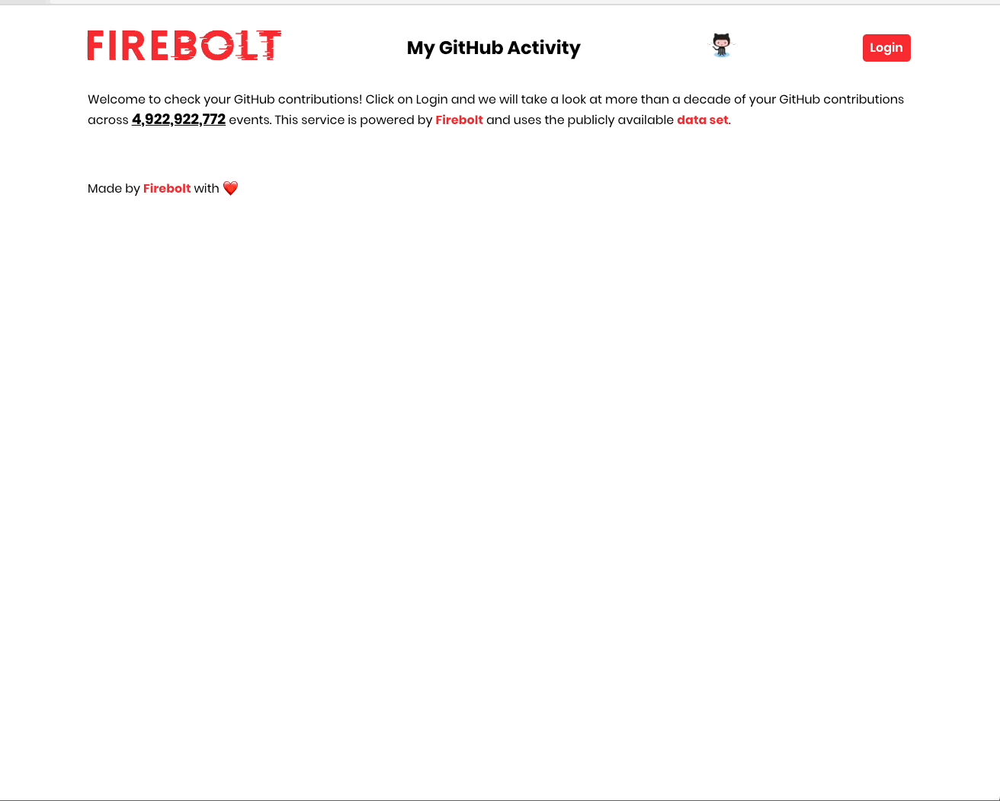

# My GitHub Activity - Using Firebolt with JDBI

This is a sample app how to use the Firebolt JDBC driver within Java to
write a web application. The application is using JDBI.

See this animated gif how it works when up and running:

This app assumes a running Firebolt database with GitHub events data.

The following environment variables are needed:

* `FIREBOLT_DATABASE`: Name of the Firebolt Database
* `FIREBOLT_USER`: Firebolt username (can be a read only user) 
* `FIREBOLT_PASSWORD`: Firebolt passowrd
* `FIREBOLT_ENGINE`: Name of the Firebolt engine
* `GITHUB_OAUTH_KEY`: GitHub OAuth key
* `GITHUB_OAUTH_SECRET`: GitHub OAuth secret
* `GITHUB_CALLBACK_URL`: GitHub OAuth callback URL. Should be your endpoint ending with `auth/login/github`, for example `http://localhost:7000/auth/login/github` for local testing

Feel free to take a look at the source, and if you have questions, please
open an issue in the [Firebolt Help Center](https://help.firebolt.io/).

## Technologies used

* [peity vanilla](https://github.com/railsjazz/peity_vanilla): Vanila JS Sparklines library inspired by peity.js
* [Javalin](https://javalin.io/): web framework
* [JDBI](https://jdbi.org/): data abstraction layer
* [Firebolt JDBC driver](https://github.com/firebolt-db/jdbc): JDBC connector
* [pac4j](https://www.pac4j.org/): authorization against GitHub
* [caffeine](https://github.com/ben-manes/caffeine): caching

